# Vallarasu Media Bucket Sync for Amazon S3

**Vallarasu Media Bucket Sync for Amazon S3** is a powerful and standalone WordPress plugin that allows you to effortlessly sync your media library attachments to Amazon S3. With a simple interface and a master toggle switch, this plugin gives you complete control over media synchronization, offloading media delivery from your server to a highly scalable S3 bucket.

Developed by **[Vallarasu Kanthasamy](https://github.com/vallarasuk)**.

## 🚀 Key Features

*   **Seamless S3 Sync**: Quickly sync your media attachments to your AWS S3 bucket.
*   **Global Enable/Disable Toggle**: Immediate frontend control over the sync status.
*   **Sub-size Syncing**: Automatically syncs all WordPress-generated responsive image sub-sizes.
*   **Dynamic URL Rewriting**: Automatically rewrites frontend image URLs to securely serve them directly from S3.
*   **User-friendly Configuration**: Easy to use settings panel in the WordPress admin area.
*   **Lightweight**: Highly performant with no unnecessary bloat.

## ⚙️ How It Works

Here is a detailed visual representation of the plugin's architecture and synchronization flow. It explains how media uploads are intercepted, how WordPress splits them into various responsive sizes, and how the frontend links are dynamically replaced to serve directly from AWS S3:

```mermaid
flowchart TD
    %% Upload Phase
    A[User Uploads Image via WordPress Media Library] --> B[WordPress Generates Sub-sizes]
    B -->|Original, Thumbnail, Medium, Large, etc.| C(Media Sync Interface)
    
    %% Sync Trigger Phase
    C -->|User Clicks 'Sync to S3'| D{Is Master Toggle Enabled?}
    D -->|No| E[Default: Images Served Locally from Server]
    D -->|Yes| F[Trigger AJAX Sync Action]
    
    %% AWS S3 Upload Phase
    F --> G[S3 Helper Class]
    G -->|Uploads Original File| H[(AWS S3 Bucket)]
    G -->|Iterates & Uploads All Sub-sizes| H
    
    %% Metadata and URL Rewriting Phase
    H -->|Return S3 Base URL| I[Save S3 URL & Sync Status to Post Meta]
    I --> J[Frontend Rendering]
    
    %% Auto-replace Links Phase
    J -->|Filter: wp_get_attachment_url| K[Auto-replace Main Attachment Links]
    J -->|Filter: wp_get_attachment_image_src| L[Auto-replace Image Source Arrays]
    J -->|Filter: wp_calculate_image_srcset| M[Auto-replace Responsive Srcset Links]
    J -->|Filter: the_content| N[Auto-replace Hardcoded Post Images]
    
    %% Final View
    K & L & M & N --> O((End User Views Images Served Directly From S3))
```

## 🛠️ Installation & Setup

1. Upload the `media-to-aws-s3-sync` folder to the `/wp-content/plugins/` directory.
2. Activate the plugin through the **Plugins** menu in WordPress.
3. Navigate to **Settings > Media to S3 Sync**.
4. Enable the synchronization using the master toggle.
5. Enter your AWS Access Key, Secret Key, Region, and Bucket name.
6. Start syncing your media directly from the Media Library!

---

## 🔗 About the Developer & Important Links

I build a variety of web applications, browser extensions, and tools for developers. Check out my work below!

### 🌍 Portfolio & Websites
*   [vallarasuk.com](https://vallarasuk.com)
*   [dev.vallarasuk.com](https://dev.vallarasuk.com)
*   [urpage.in](http://urpage.in)

### 🛠️ Apps & Tools
*   [Live TV](https://livetv.vallarasuk.com/)
*   [ATS Resume Maker](https://atsresumemaker.vallarasuk.com/)
*   [Place Finder](https://placefinder.vallarasuk.com/)
*   [Books](https://books.vallarasuk.com/)
*   [Space](https://space.vallarasuk.com/)
*   [Typer](https://typer.vallarasuk.com/)
*   [Developer Resources](https://vallarasuk.com/resources)

### 💻 VS Code Extensions
*   **Auto Console Log**: [VS Code Marketplace](https://marketplace.visualstudio.com/items?itemName=VallarasuKanthasamy.auto-console-log-by-vallarasu-kanthasamy) | [OpenVSX](https://open-vsx.org/extension/VallarasuKanthasamy/auto-console-log-by-vallarasu-kanthasamy)
*   **Universal Spreadsheet Markdown Editor**: [OpenVSX](https://open-vsx.org/extension/VallarasuKanthasamy/universal-spreadsheet-markdown-editor)
*   [My Publisher Profile](https://marketplace.visualstudio.com/publishers/VallarasuKanthasamy)

### 🧩 Chrome Extensions
*   [Tech Stack Checker](https://chromewebstore.google.com/detail/tech-stack-checker/lhcplmfhkmjobfnndaabeddibhimghgf?hl=en)
*   [Opacity Adjuster](https://chromewebstore.google.com/detail/opacity-adjuster/elgajofcbjicopepiodbabodkajnihog?hl=en)

### 👥 Social & Community
*   **LinkedIn**: [linkedin.vallarasuk.com](https://linkedin.vallarasuk.com)
*   **GitHub**: [github.vallarasuk.com](https://github.vallarasuk.com)
*   **Instagram**: [insta.vallarasuk.com](http://insta.vallarasuk.com/)
*   **WhatsApp Community**: [squad.vallarasuk.com](http://squad.vallarasuk.com/)
*   **WhatsApp Group**: [Join Here](https://chat.whatsapp.com/JzCFT47gI6aE8O6mJA96V0)

### 📚 Open Source
*   [Awesome Developer Resources](https://github.com/vallarasuk/awesome-developer-resources)
